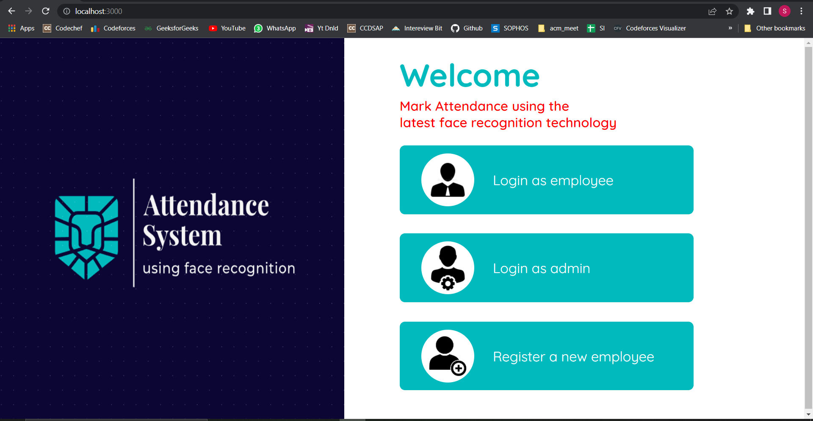

<p align="center">
  
</p>
<hr />

> ## Documentation
- [Demo video](https://www.youtube.com/watch?v=vMN3TqF4mh0)
- [Project Documentation](https://drive.google.com/file/d/11-Gpa0EchzVZUVbFB80fiSV7221bl4R2/view?usp=sharing)

> ## Local Setup
- client
```sh
   cd attendance-frontend
   npm install 
   npm run start
```
- server
```sh
   cd attendance-backend
   mkdir Training_images
   pip install -r requirements.txt 
   python app.py
```
> ## Special Instructions to run the Web-Application
1. The username for logging-in as admin is admin, and the password is admin123 (case sensitive). 
2. The employee number for registration must be unique every time a new employee registers. 
3. The frontend runs on localhost:3000 and backend runs on localhost:5000. 

> ## Features
1. Register a new employee and click his/her registration image.
2. Login as employee and mark your entry-time/exit-time attendance using face-recognition.
3. View your profile as employee and search your attendance for any range of dates.
4. Assess employees' performance with the help of working hours vs date bar graph. 
5. Login as admin to search for the attendance data of any employee, as well as for any particular date.

> ## Tech Stack 
- ReactJS with CSS for frontend.
- Flask, opencv, and face_recognition modules of python for backend.
- SQLite for Database and flask_sqlalchemy module of python for handling create-read-update queries.  

> ## Developed by 
- Name : Srijan Kumar
- Email : srijanrathor8@gmail.com
- College : Birla Institute of Technology, Mesra
- Discipline : Computer Science and Engineering (B.Tech.)
- Graduation : 2024